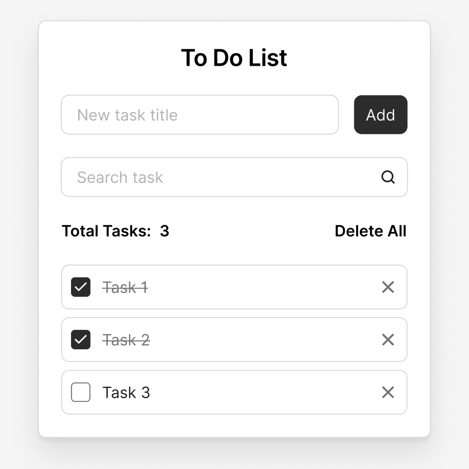

# 📝 To Do List на чистом JavaScript

Простое, минималистичное приложение "To Do List", написанное **без фреймворков и библиотек** — только **HTML**, **CSS** и **Vanilla JS**.

📸 Дизайн

Интерфейс взят из бесплатного макета Figma. Выглядит чисто и понятно:



🔗 [Ссылка на макет в Figma](https://www.figma.com/design/5g3oOYX6GNlezUCuk1xmaS/To-Do-List)

## ⚙️ Возможности

- ✅ Добавление новой задачи (через отдельное поле)
- ✅ Поиск по текущим задачам (в реальном времени)
- ✅ Отметка задачи как выполненной
- ✅ Удаление одной задачи
- ✅ Удаление всех задач
- ✅ Счётчик количества задач
- ✅ Сохранение всех данных в `localStorage`
- ✅ Поддержка Enter-клавиши и автофокуса

## 💡 Стек

- **HTML5**
- **CSS3**
- **JavaScript (ES6+)**  
  Без сборщиков, библиотек, фреймворков или внешних зависимостей

## 🚀 Как запустить

1. Клонируй репозиторий:

```bash
git clone git@github.com:aleksanderlamkov/todo-vanilla.git
```

2. Открой `index.html` в браузере — всё работает без сборки.
